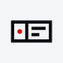

<!-- The product mark: GitHub serves the ink per theme via <picture>; npm keeps the
     light asset (it strips <source> but leaves the ) and rewrites the relative
     path to the repo's raw URL. -->
<picture>
  <source media="(prefers-color-scheme: dark)" srcset="assets/mark-dark.svg">
  
</picture>

# DKProductCard

A product card for MDX blogs, extracted from [diklein.com](https://diklein.com). Paste an Amazon link on its own line, get a card.

Two pieces, use either or both:

- **The component.** A quiet, bordered product card: title, description, image, an optional status strip across the top ("Retired", "Updated"), and a note style for one-sentence asides. Distributed through the shadcn registry, so the code lands in your project and you own it.
- **The remark plugin.** Turns a bare Amazon product URL, a paragraph that is nothing but the link, into a card element at build time. Inline links inside sentences are left alone.

## Install

The component:

```sh
npx shadcn add https://diklein.com/r/dk-product-card.json
```

This copies `product-card.tsx` and `dk-product-card.css` into `components/dk-product-card/` and installs the remark plugin from npm. Import the stylesheet once, in your global CSS or root layout:

```ts
import '@/components/dk-product-card/dk-product-card.css'
```

The plugin alone:

```sh
npm install @diklein/dkproductcard
```

## The plugin

Add it to your MDX pipeline and map the component name in your MDX components file:

```js
// next.config.mjs
import remarkAmazonProduct from '@diklein/dkproductcard'

const withMDX = createMDX({
  options: {
    remarkPlugins: [remarkAmazonProduct],
  },
})
```

> With Turbopack, remark plugins must be passed as strings: `remarkPlugins: ['@diklein/dkproductcard']`.

```tsx
// mdx-components.tsx
import { DKProductCard } from '@/components/dk-product-card/product-card'

export function useMDXComponents(components) {
  return { ...components, DKProductCard, ...components }
}
```

Now this in a post:

```md
I finally replaced my desk stand.

https://www.amazon.com/dp/B0ABCDEFGH
```

renders the paragraph as `<DKProductCard asin="B0ABCDEFGH" />`. Both `/dp/` and `/gp/product/` URLs match, on any Amazon marketplace TLD.

Emitting a different element name:

```js
remarkPlugins: [[remarkAmazonProduct, { component: 'ProductCard' }]]
```

## The component

```tsx
<DKProductCard
  title="Heckler Design @Rest"
  description="The iPad stand that outlived the iPad."
  asin="B0ABCDEFGH"
  image="/images/gear/atrest.png"
/>
```

| Prop | Type | What it does |
| --- | --- | --- |
| `title` | `string` | Product name. |
| `description` | `string` | Muted supporting line. |
| `asin` | `string` | Builds the Amazon link and switches the label to "Amazon". |
| `href` | `string` | Explicit link target, wins over `asin`. Omit both for an unlinked card. |
| `label` | `string` | Link label. Defaults to "Amazon" or "View". |
| `image` | `string` | Product image, in a fixed square slot. |
| `imageAlt` | `string` | Alt text. Falls back to `title`. |
| `strip` | `string` | Status band across the top of the card. |
| `retired` | `boolean` | Sugar for `strip="Retired"`. |
| `children` | `ReactNode` | Note-style body: a strip plus a sentence, no image or title. Links inside pick up the accent treatment. |
| `renderImage` | `(src, ctx) => ReactNode` | Render the image yourself, e.g. with next/image. |

A note card:

```mdx
<DKProductCard strip="Updated">
  Dot was [removed](https://new.computer/) from the App Store in 2025.
</DKProductCard>
```

An unlinked card renders as a plain div: no label, no hover affordance, nothing that promises a click it cannot deliver.

## Theming

Every color routes through a `--dkpc-*` token; override them on `.dkpc-scope`:

```css
.dkpc-scope {
  --dkpc-accent: rebeccapurple;
  --dkpc-font-sans: 'Inter', sans-serif;
}
```

Dark mode follows the shadcn convention (a `.dark` class on `<html>`) and falls back to `prefers-color-scheme` when no theme class is present.

## License

MIT
